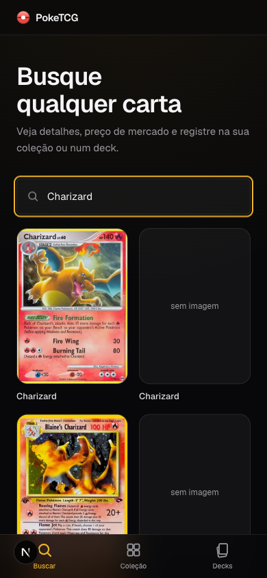
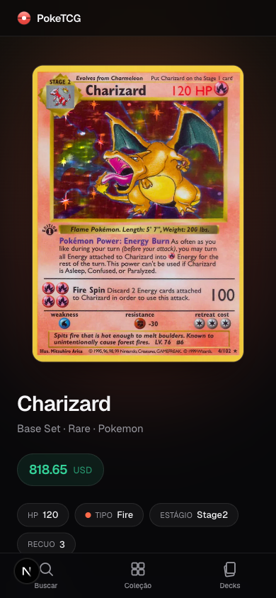
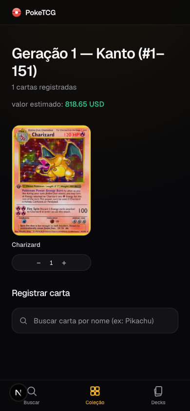
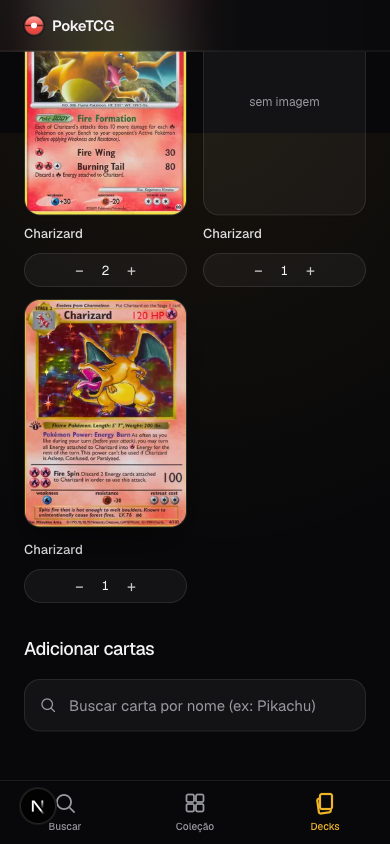

# PokeTCG

App pessoal de análise de cartas Pokémon TCG: busca qualquer carta, mostra preço de mercado, e organiza numa Pokédex (por geração), num Set específico, ou em decks com análise. Sem conta, sem backend — tudo fica no `localStorage` do navegador.

Produção: **https://poketcg-theta.vercel.app**

<p align="center">
  
  
  
  
</p>

## Funcionalidades

- **Busca** por nome, "Nome nº" (`Pikachu 58`) ou ID exato da TCGdex (`base1-4`) — resultados já mostram set, código impresso, raridade e preço, pra distinguir entre várias impressões do mesmo Pokémon.
- **Escanear pela câmera**: aponta, tira uma foto, OCR lê o nome/número da carta e pré-preenche a busca.
- **Coleção** em três abas:
  - **Pokédex** — progresso por geração (Kanto a Paldea), "tenho pelo menos uma carta desse Pokémon".
  - **Sets** — acompanhe um set real da TCGdex com logo oficial, "tenho esta impressão específica".
  - **Cartas** — coleções livres, sem estrutura fixa.
- Carta buscada na home registra sozinha na Pokédex certa (descobre a geração pelo Pokémon).
- **Decks** com registro de cartas por quantidade e painel de análise: categoria, tipo, curva de custo de recuo, HP médio, preço total estimado.
- **PWA** — instalável na tela inicial, funciona offline pra conteúdo já visitado.

## Stack

Next.js 16 (App Router) + React 19 + TypeScript + Tailwind CSS v4, dados via [TCGdex](https://tcgdex.dev) (sem SDK, `fetch` direto), OCR client-side com `tesseract.js`. Detalhes e decisões de arquitetura em [`ARCHITECTURE.md`](./ARCHITECTURE.md).

## Rodando localmente

```bash
npm install
npm run dev      # http://localhost:3000
npm run build    # build de produção
npm run test     # self-check da lógica de análise de deck e do OCR
npm run lint
```

Sem `.env` — a API do TCGdex é pública, sem chave.

## Documentação

- [`CHANGELOG.md`](./CHANGELOG.md) — o que mudou, em ordem
- [`ARCHITECTURE.md`](./ARCHITECTURE.md) — stack, estrutura de pastas, decisões não óbvias
- [`ROADMAP.md`](./ROADMAP.md) — feito, em andamento, planejado
